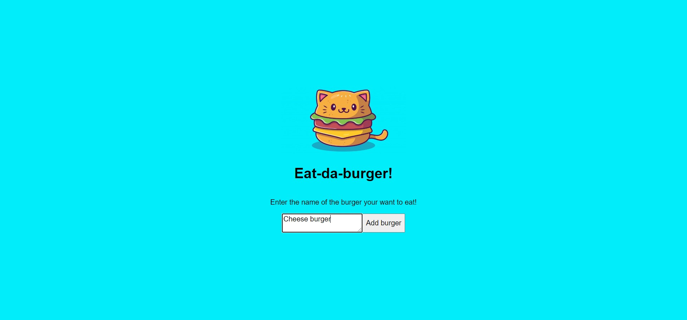
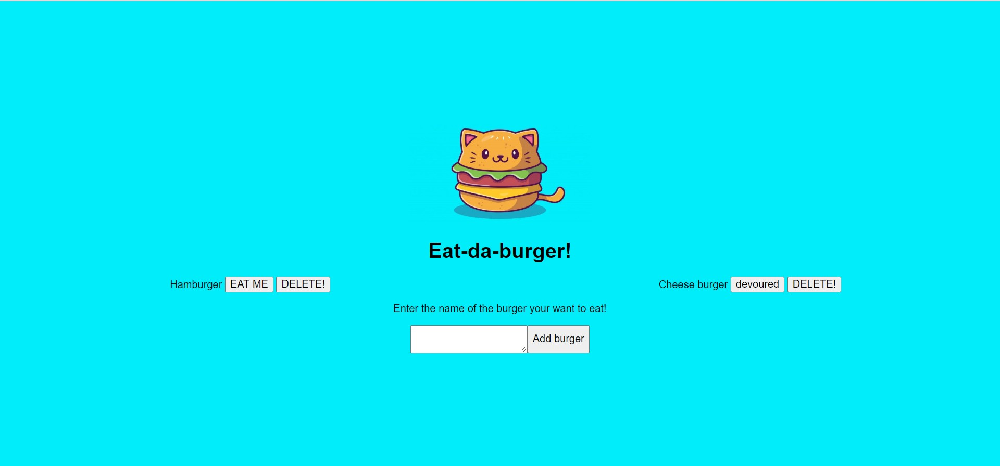
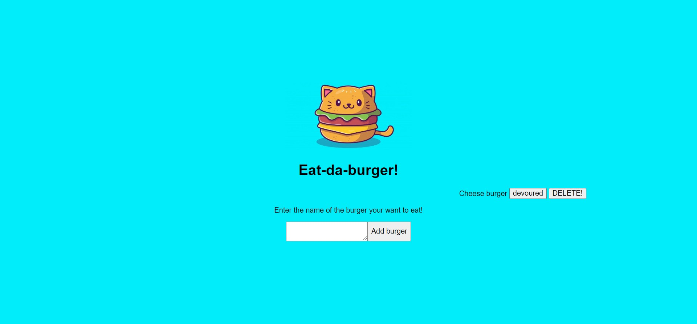

[contributors-shield]: https://img.shields.io/github/contributors/Zypherone/eat-da-burger.svg?style=flat-square
[contributors-url]: https://github.com/Zypherone/eat-da-burger/graphs/contributors
[forks-shield]: https://img.shields.io/github/forks/Zypherone/eat-da-burger.svg?style=flat-square
[forks-url]: https://github.com/Zypherone/eat-da-burger/network/members
[stars-shield]: https://img.shields.io/github/stars/Zypherone/eat-da-burger.svg?style=flat-square
[stars-url]: https://github.com/Zypherone/eat-da-burger/stargazers
[issues-shield]: https://img.shields.io/github/issues/Zypherone/eat-da-burger.svg?style=flat-square
[issues-url]: https://github.com/Zypherone/eat-da-burger/issues
[build-style-shield]: https://img.shields.io/badge/code%20style-standard-brightgreen.svg?style=flat
[build-style-url]: https://github.com/feross/standard
[license-shield]: https://img.shields.io/github/license/Zypherone/eat-da-burger.svg?style=flat-square
[license-url]: http://choosealicense.com/licenses/mit/

[![Contributors][contributors-shield]][contributors-url] [![Forks][forks-shield]][forks-url] [![Stargazers][stars-shield]][stars-url] [![Issues][issues-shield]][issues-url] [![JS Standard][build-style-shield]][build-style-url] [![MIT License][license-shield]][license-url]

# 13-MVC: (Node Express Handlebars) Eat-Da-Burger!

#### Table of Contents
- [Screenshots](#Screenshots)
- [Built With](#Built_With)
- [Code Style](#Code_Style)
- [Installation](#Installation)
- [Demo](#Demo)
- [Usage](#Usage)
- [Credits](#Credits)
- [Contributing](#Contributing)
- [License](#License)

---

## Screenshots
|Screenshot One|Screenshot Two|Screenshot Three|
|----|----|----|
||||

## Built with
- [Node.js](https://nodejs.org/en/)
- [Express.js](https://expressjs.com/)
- [Handlebars.js](https://expressjs.com/)
- [MySQL](https://www.npmjs.com/package/mysql/)
- [normalize.css](http://necolas.github.io/normalize.css/)

## Code style
[![JS Standard][build-style-shield]][build-style-url] - https://github.com/standard/standard

---

## Installation

Download (and unpack) or clone the repo. Using MySQL or MSSQL database, create the DB using the schema.sql file, you can reciew the database schema on the Sql schema file. 

```SQL
DROP DATABASE IF EXISTS burgers_db;
CREATE DATABASE burgers_db;
USE burgers_db;

CREATE TABLE burgers
(
    id int NOT NULL AUTO_INCREMENT,
    name VARCHAR(110) NOT NULL,
    devoured BOOLEAN DEFAULT false,
    PRIMARY KEY (id)
)
```

Then using a CLI run the following:

```
npm install
```

Then run the application by typing ```npm run start``` into the CLI:

```
npm run start
```

Then use your preferred browser to access the App.

## Demo

Click https://limitless-cove-05062.herokuapp.com/ to visit a live demo.

## Usage 
The primary purpose of this was to meet the requirements of a homework assignment. The major goal seems to be practice with Express, Handlebars and MySQL.

## Credits 
I created this code based on the homework prompt created by Triology Education Services. Certain pieces of code I used online resources for help. 

## Contributing 
I was the only one to work on this project, but of course I had help from my instructor, TA's, and classmates.

## License
| Details | Author |
|---|---|
|This project is licensed under the MIT License - see [choosealicense.com](http://choosealicense.com/licenses/mit/) for more details.<br />A short and simple permissive license with conditions only requiring preservation of copyright and license notices. Licensed works, modifications, and larger works may be distributed under different terms and without source code.<br /><br />[](http://choosealicense.com/licenses/mit/) [](zypherone@github.com)|  |
